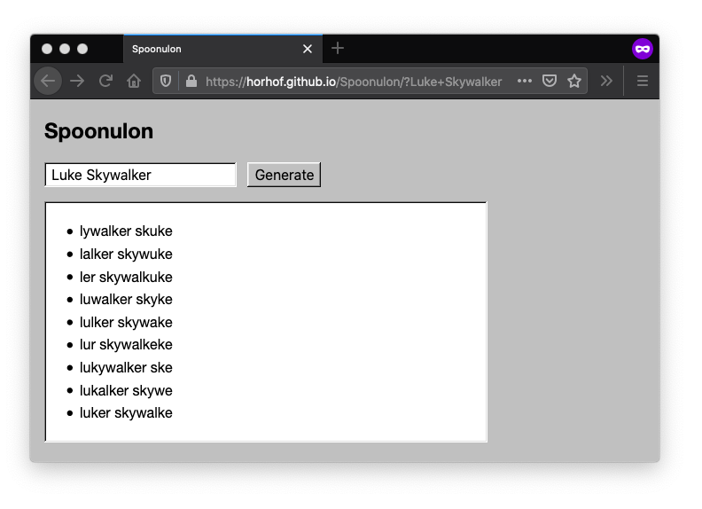

# Spoonulon

Spoonulon is a program for generating Spoonerisms from two words.

>  A spoonerism is an error in speech in which corresponding consonants, vowels, or morphemes are switched between two words in a phrase, such as saying "The Lord is a shoving leopard" instead of "The Lord is a loving shepherd."
>
> These are named after the Oxford don and ordained minister William Archibald Spooner, who was famous for doing this.
>
> &mdash;[Spoonerism](https://en.wikipedia.org/wiki/Spoonerism)

## Usage

* Compile the TypeScript (`npx tsc` or `npm run compile`).
* View index.html.

## Examples

People's names, e.g. [Matsuo Basho](https://horhof.github.io/Spoonulon/?Matsuo+Basho):

* Mo Bashatsuo
* Matsasho Buo
* Matso Bashuo

Characters, e.g. [Conan the Barbarian](https://horhof.github.io/Spoonulon/?Conan+Barbarian):

* Carbarian Bonan
* Conarian Barban
* Conian Barbaran

Phrases, e.g. [ohayo gozaimasu](https://horhof.github.io/Spoonulon/?Ohayo+gozaimasu):

* Osu Gozaimahayo
* Ohozaimasu Gayo
* Ohayasu Gozaimo

Things, e.g. [automated testing](https://horhof.github.io/Spoonulon/?automated+testing):

* Auting Testomated
* Autosting Temated
* Automatesting Ted
